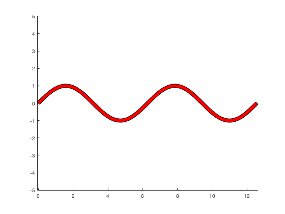
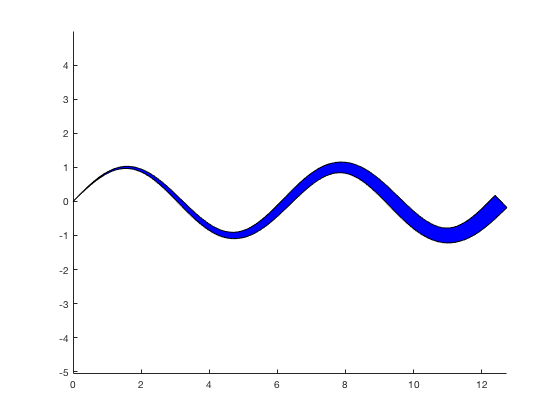
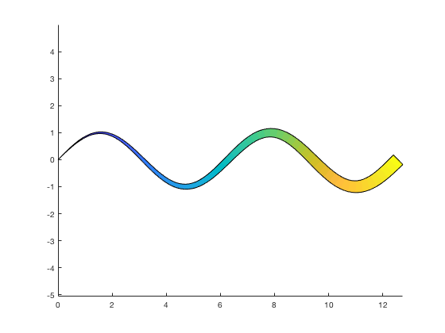

# line2poly.m: Convert a line to a polygon


Author: Kelly Kearney


This repository includes the code for the `line2poly.m` Matlab function, along with all dependent functions required to run it.


This function creates a polygon that follows a center line with a prescribed width orthoganal to that central polyline.


## Contents

            
- Getting started        
- Syntax        
- Example 1: A line of constant width        
- Example 2: A line with varying width        
- Example 3: Using the color output        
- Contributions

## Getting started


**Prerequisites**


This function requires Matlab R14 or later.


**Downloading and installation**


This code can be downloaded from [Github](https://github.com/kakearney/line2poly-pkg/).


**Matlab Search Path**


The following folders need to be added to your Matlab Search path (via `addpath`, `pathtool`, etc.):


```matlab
line2poly-pkg/line2poly
```


## Syntax


`[xp,yp] = line2poly(x,y,w)` returns the patch coordinates `xp` and `yp` for the polygon defined by a central polyline with vector coordinates `x` and `y`.  The width `w` can be either a scalar value defining the orthognal width along the entire length of the polyline, or a vector the same size as `x` and `y` defining the width at each polyline vertex.


`[xp,yp,cp] = line2poly(x,y,w)` returns an additional output `cp` that defines the distance of each polygon vertex along the line (measured orthoganal to the line).  This value can be passed to patch to  create a color gradient along the patch polygon from one end to the other.


## Example 1: A line of constant width


```matlab
x = linspace(0, 4*pi, 100);
y = sin(x);

[xp,yp] = line2poly(x,y,0.2);

patch(xp,yp,'r');
axis equal;
```





## Example 2: A line with varying width


```matlab
x = linspace(0, 4*pi, 100);
y = sin(x);
w = linspace(0,0.5,100);

[xp,yp, cp] = line2poly(x,y,w);

cla;
patch(xp,yp,'b');
axis equal;
```





## Example 3: Using the color output


```matlab
cla;
patch(xp,yp,cp);
axis equal;
```





## Contributions


Community contributions to this package are welcome!


To report bugs, please submit [an issue](https://github.com/kakearney/example-pkg/issues) on GitHub and include:


  - your operating system
  - your version of Matlab and all relevant toolboxes (type `ver` at the Matlab command line to get this info)
  - code/data to reproduce the error or buggy behavior, and the full text of any error messages received

Please also feel free to submit enhancement requests, or to send pull requests (via GitHub) for bug fixes or new features.


I do monitor the MatlabCentral FileExchange entry for any issues raised in the comments, but would prefer to track issues on GitHub.


<sub>[Published with MATLAB R2018a]("http://www.mathworks.com/products/matlab/")</sub>
